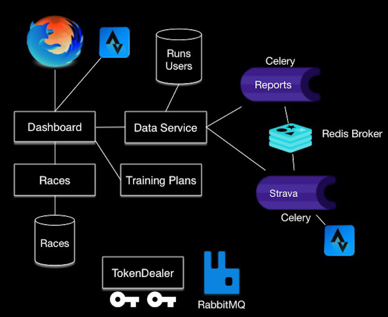
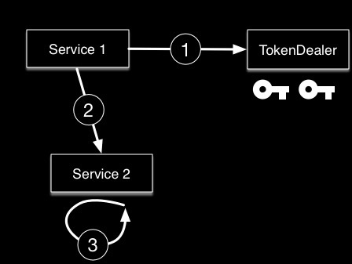
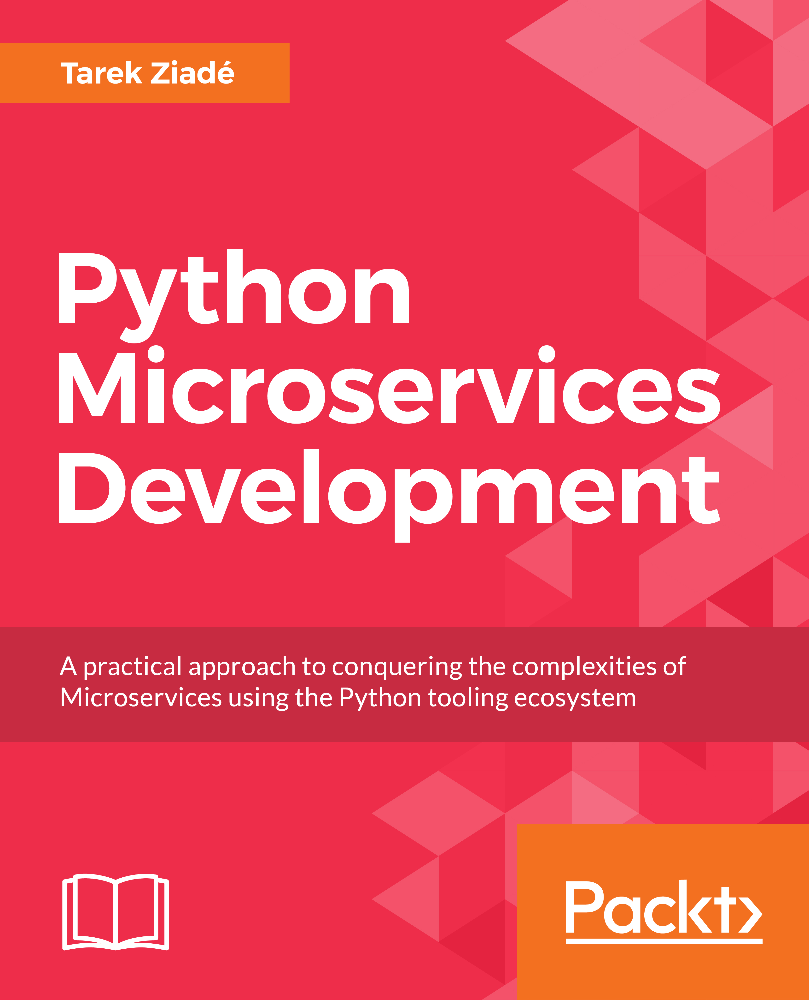

Pycon Belarus 2018
++++++++++++++++++

----

Building Microservices in Python
--------------------------------

----

Who am I
--------

- Python developer at Mozilla (7+ years)
- 1st Python dev @ Mozilla Services (2009)
- Built Firefox Sync, and numerous web services
- Working on performance metrics in Firefox Quantum

Twitter - @tarek_ziade

----

Why this topic ?
----------------

- Wrote a book about microservices (Packt)
- Done lots of services @ Mozilla
- Busting the myth around "micro-"
- Python shines at this!

----

Definition
----------

A microservice is a :emphasis:`lightweight` application,
which provides a :emphasis:`narrowed` list of features with
a :emphasis:`well-defined contract`

It's a component with a :emphasis:`single responsibility`,
which can be developed and deployed :emphasis:`independently`

----

Benefits
--------

- separation of concerns
- smaller projects
- more scaling & deployment options

----

Risks
-----

- bad design decisions
- network overhead
- testing is harder
- data storing & sharing more complex
- compatibility issues

----

4 key principles
----------------

----

Rule #1
-------

.. centered::

  Microservices
  happens over time,
  not on day 1.

----

Rule #2
-------

.. centered::

   Premature splitting
   is the root of all evil

----

Rule #3
-------

.. centered::

   Avoid building
   "CRUD microservices"

----

Rule #4
-------

.. centered::

   Use standard protocols.

----

Standard Protocols
------------------

- HTTP 1.x JSON APIs -- good enough in most cases
- RESTful design (more of less) with versionning
- Swagger, Json-Schema
- Token-based authentication (JWT, OAuth2)

----

Designing HTTP API
------------------

- Don't surface too many details (like CRUD)
- Version your APIs
- Backward compatibility makes life easier
- Json-Schema can help for data checking

----

Frameworks
----------

.. centered::

    Bottle, Connexion, Falcon,
    Flask, Twisted,
    aiohttp, Tornado, Celery, ...

----

My Choice
---------

.. centered::

   Flask
   mature
   rich ecosystem

.. centered::

   aiohttp
   async
   Python 3.5+

----

Book Case Study
---------------

.. class::  full

----

Full microservice in Flask
--------------------------

.. code-block:: python

    from flask import Flask, jsonify

    app = Flask(__name__)

    @app.route('/api/v1/foo')
    def foo():
        return jsonify({'some': 'result'})

    if __name__ == '__main__':
        app.run()

----

Messaging between Services
--------------------------

- Push/Pull - one dealer, many workers
- Publish/Subscribe - Event-based actions
- Direct calls - 1:1 link, plain HTTP

----

Push/Pull - Celery Microservice
-------------------------------

.. code-block:: python

    # strava.py - strava worker microservice
    from celery import Celery

    REDIS = 'redis://localhost:6379'
    celery = Celery(__name__, backend=REDIS, broker=REDIS)

    @celery.task(name='strava-fetch')
    def strava_fetch(user_id):
        return get_strava_data(user_id)

Run the service with:

.. code-block:: sh

   $ celery -A strava worker

----

Push-Pull - Sending jobs to Workers
-----------------------------------

.. code-block:: python

    celery = Celery(__name__, backend=REDIS, broker=REDIS)

    @app.route('/api/v1/user/<user_id>/fetch_data')
    def fetch_data(user_id):
        # notice that we don't import the strava.py module
        celery.send_task('strava-fetch', [user_id], {})
        # ...
        return jsonify({'fetching': ['strava']})

----

Celery = subset of what RabbitMQ can do
---------------------------------------

----

PubSub - Sending RMQ events
---------------------------

.. code-block:: python

    from pika import BlockingConnection as Conn
    from pika import BasicProperties as Props

    def message(topic, message):
        channel = Con().channel()
        channel.basic_publish('incoming', topic,
                              message, Props())

    # race results
    message('reports', 'Report #2 ready')

----

PubSub - Consuming RMQ events
-----------------------------

:subtitle:`Sync Frameworks`
:br:`RabbitMQ-to-HTTP-API bridge`
RabbitMQ JSON push plugin

:subtitle:`Async Frameworks`
Recurring polling callback

----

PubSub - RMQ Bridge 1/2
-----------------------

.. code-block:: python

    # rmqbrige.py - forwarding RMQ events
    connection = pika.BlockingConnection()
    channel = connection.channel()
    channel.basic_consume(on_message, queue='reports')
    try:
        channel.start_consuming()
    except KeyboardInterrupt:
        channel.stop_consuming()
    connection.close()

----

PubSub - RMQ Bridge 2/2
-----------------------

.. code-block:: python

    FLASK = 'http://localhost:5000/event'

    def on_message(channel, method_frame, header_frame, body):
        tag = method_frame.delivery_tag
        message = {'delivery_tag': tag, 'message': body}
        res = requests.post(FLASK, json=message, timeout=1)
        if res.status_code == 200:
            # successfully forwarded to Flask app
            channel.basic_ack(delivery_tag=tag)

----

Direct calls
------------

:subtitle:`Sync Frameworks`
:emphasis:`Requests` Session with retry-on-failure and timeout

:subtitle:`Async Frameworks`
Async calls with :emphasis:`aiohttp.Client`

----

Token-based S2S Auth
--------------------

**OAuth2 Client Credential Grant w/ Json Web Tokens**

----

Json Web Token
--------------

- JSON containing info like scope, ttl, etc (self-contained)
- encoded and signed
- signed with shared secret or pub/priv keys
- priv/pub key == more secure, bug bigger token

----

Checking a JWT token
--------------------

.. code-block:: python

    import jwt

    def authenticate():
        key = request.headers.get('Authorization')
        token = key.split(' ')[1]
        try:
            token = jwt.decode(token, pub_key)
        except Exception:
            # INVALID!
            return abort(401)

        # VALID TOKEN, PROFIT!

----

Testing microservices
---------------------

- Testing is **hard**
- Reproducible dev deployment required
- Unit/Functional - mocking calls (requests-mock, ...)
- Integration tests on realistic deployments (WebTest+Proxy, Molotov)

----

Deploying
---------

- CI all the things (Travis-CI, Jenkins, Circle-CI)
- Docker all the things (not the Database!)
- Use the Cloud (AWS, ..), check native cloud tools

----

Monitoring/debugging
--------------------

- Datadog - statsd, perf etc
- Sentry - tracebacks
- **Graylog** -- traceback and perfs

----

Conclusion
----------

- Python is great to write microservices
- One of the best ecosystem
- Microservices are dangerous, be conservative
- Sometimes, a good old monolith is better!

----

Thank you!
----------

